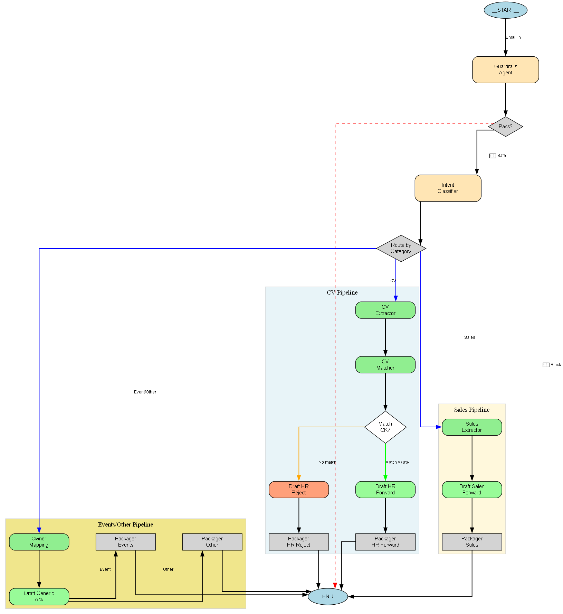

# Sistema Automatizado de Routing y Clasificación de Comunicaciones Empresariales mediante Arquitectura Multiagente

## Resumen Ejecutivo

El presente informe documenta el desarrollo e implementación de un sistema automatizado de procesamiento y enrutamiento de comunicaciones empresariales basado en una arquitectura multiagente utilizando el SDK de OpenAI Agents. El sistema está diseñado para clasificar, analizar y direccionar automáticamente diferentes tipos de comunicaciones (currículums, consultas comerciales y solicitudes de eventos) hacia los departamentos correspondientes, optimizando los procesos de gestión empresarial de Aurora Agentics.

**Actualización:** El sistema ahora incluye soporte multi-modal para procesar archivos PDF e imágenes directamente, utilizando las capacidades nativas de los modelos de OpenAI sin bibliotecas externas de OCR o extracción.

---

## 1. Introducción

### 1.1 Contexto

En el ámbito empresarial contemporáneo, las organizaciones reciben diariamente un volumen considerable de comunicaciones que requieren clasificación, análisis y enrutamiento hacia los departamentos apropiados. La gestión manual de estos flujos de información resulta ineficiente, propensa a errores y consume recursos humanos significativos que podrían destinarse a actividades de mayor valor agregado.

Aurora Agentics, una empresa de consultoría especializada en inteligencia artificial y automatización de procesos, identificó la necesidad de automatizar el procesamiento de sus comunicaciones entrantes, particularmente aquellas relacionadas con candidaturas laborales, oportunidades comerciales y propuestas de colaboración en eventos.

### 1.2 Problemática

#### 1.2.1 Problema General

La ausencia de un sistema automatizado de clasificación y enrutamiento de comunicaciones empresariales genera ineficiencias operativas, retrasos en tiempos de respuesta y suboptimización de recursos humanos en tareas repetitivas de bajo valor agregado.

#### 1.2.2 Problemas Específicos

1. **Clasificación manual ineficiente**: El personal debe revisar manualmente cada comunicación para determinar su naturaleza y destino apropiado.

2. **Falta de consistencia en el análisis**: La evaluación subjetiva de currículums y propuestas comerciales genera inconsistencias en los criterios de selección y priorización.

3. **Ausencia de mecanismos de seguridad**: No existen filtros automáticos para detectar contenido inapropiado, información sensible o intentos de manipulación del sistema.

4. **Tiempos de respuesta prolongados**: La dependencia de procesamiento humano incrementa los tiempos entre la recepción de una comunicación y su gestión efectiva.

5. **Dificultad en el seguimiento y auditoría**: La falta de trazabilidad estructurada dificulta el análisis de métricas y la optimización continua del proceso.

---

## 2. Objetivos

### 2.1 Objetivo General

Desarrollar e implementar un sistema automatizado de procesamiento y enrutamiento de comunicaciones empresariales basado en una arquitectura multiagente, que permita clasificar, analizar y direccionar automáticamente diferentes tipos de comunicaciones hacia los departamentos correspondientes, garantizando seguridad, consistencia y eficiencia operativa.

### 2.2 Objetivos Específicos

1. **Implementar un sistema de guardrails**: Desarrollar mecanismos de moderación de contenido que detecten y filtren comunicaciones con contenido inapropiado, información personal sensible o intentos de manipulación del sistema.

2. **Crear un clasificador de intenciones**: Diseñar un agente capaz de identificar automáticamente la categoría de cada comunicación (candidatura laboral, consulta comercial, propuesta de evento u otra) con un nivel de confianza cuantificable.

3. **Desarrollar un sistema de matching de candidatos**: Implementar un módulo de evaluación automatizada de currículums que compare las competencias de los candidatos con las vacantes disponibles utilizando algoritmos de scoring ponderado.

4. **Construir un calificador de leads comerciales**: Diseñar un sistema de puntuación de oportunidades comerciales que evalúe múltiples dimensiones (presupuesto, timeline, perfil del contacto, claridad del caso de uso) para priorizar la atención del equipo de ventas.

5. **Automatizar la generación de respuestas**: Implementar agentes especializados en la creación de comunicaciones (aceptaciones, rechazos, solicitudes de información adicional) adaptadas al contexto y tono apropiado.

6. **Establecer un sistema de visualización arquitectónica**: Desarrollar herramientas de documentación visual que permitan comprender, comunicar y optimizar la estructura del sistema multiagente.

7. **Implementar soporte multi-modal**: Integrar capacidades de procesamiento de archivos PDF e imágenes mediante el envío directo de archivos a los modelos de OpenAI, sin utilizar bibliotecas externas de OCR o extracción de datos.

---

## 3. Metodología

### 3.1 Enfoque de Desarrollo

La implementación del sistema se basó en una metodología de desarrollo iterativo utilizando principios de arquitectura orientada a agentes. Se adoptó el SDK de OpenAI Agents como framework tecnológico principal, complementado con Pydantic para validación de esquemas y Python como lenguaje de programación base.

El sistema fue posteriormente extendido para soportar entradas multi-modales (PDFs e imágenes) mediante la integración directa con las capacidades de visión y procesamiento de documentos de los modelos de OpenAI, eliminando la necesidad de bibliotecas de extracción de terceros.

### 3.2 Arquitectura del Sistema

#### 3.2.1 Diseño Multiagente

El sistema se estructuró mediante una arquitectura de microservicios basada en agentes especializados, donde cada agente cumple una función específica dentro del flujo de procesamiento. Esta arquitectura modular permite:

- Separación de responsabilidades
- Facilidad de mantenimiento y evolución
- Capacidad de testing independiente por componente
- Escalabilidad horizontal

#### 3.2.2 Componentes del Sistema

El sistema está conformado por 15 agentes especializados organizados en tres pipelines principales:

**A. Pipeline de Procesamiento de Candidaturas (CV)**

1. **Guardrails Agent**: Validación de seguridad y moderación de contenido
2. **Intent Classifier**: Clasificación de la intención de la comunicación
3. **CV Extractor**: Extracción de información estructurada del currículum
4. **CV Matcher**: Evaluación y matching con vacantes disponibles
5. **Draft HR Forward**: Generación de comunicación interna para RRHH (casos positivos)
6. **Draft HR Reject**: Generación de respuesta de rechazo al candidato
7. **HR Forward Packager**: Empaquetado final de comunicación interna
8. **HR Reject Packager**: Empaquetado final de respuesta al candidato

**B. Pipeline de Procesamiento de Leads Comerciales**

1. **Guardrails Agent**: Validación de seguridad (compartido)
2. **Intent Classifier**: Clasificación de intención (compartido)
3. **Sales Extractor**: Extracción y calificación de lead comercial
4. **Draft Sales Forward**: Generación de comunicación interna para ventas
5. **Sales Packager**: Empaquetado final de briefing comercial

**C. Pipeline de Procesamiento de Eventos y Otros**

1. **Guardrails Agent**: Validación de seguridad (compartido)
2. **Intent Classifier**: Clasificación de intención (compartido)
3. **Owner Mapping**: Mapeo hacia departamento responsable
4. **Draft Generic Ack**: Generación de acuse de recibo genérico
5. **Events Packager**: Empaquetado para equipo de eventos
6. **Other Packager**: Empaquetado para comunicaciones diversas

### 3.3 Flujo de Procesamiento

#### 3.3.1 Etapa de Validación Inicial

Toda comunicación entrante atraviesa primero el agente de guardrails, que ejecuta tres verificaciones críticas:

1. **Moderación de contenido**: Detección de contenido violento, sexual, discriminatorio o inapropiado
2. **Protección de información sensible**: Identificación y redacción de datos personales sensibles (números de identificación, direcciones físicas, números telefónicos en contextos inapropiados)
3. **Detección de jailbreaking**: Identificación de intentos de manipulación del sistema mediante prompts adversariales

Si la comunicación no supera las validaciones de seguridad, el sistema genera inmediatamente una respuesta de bloqueo y finaliza el procesamiento.

#### 3.3.2 Etapa de Clasificación

Las comunicaciones que superan la validación de seguridad son procesadas por el clasificador de intenciones, que determina:

- **Categoría**: CV, sales, event u other
- **Idioma**: es, en, pt u other
- **Nivel de confianza**: Score de 0.0 a 1.0

Esta clasificación determina qué pipeline específico procesará la comunicación.

#### 3.3.3 Etapa de Procesamiento Específico

Dependiendo de la categoría identificada, la comunicación es direccionada al pipeline correspondiente:

**Pipeline CV:**
- Extracción de datos estructurados del candidato
- Cálculo de scoring ponderado contra vacantes disponibles
- Decisión de aceptación (match >= 70%) o rechazo
- Generación de comunicación apropiada

**Pipeline Sales:**
- Extracción de información del lead
- Calificación mediante scoring multidimensional
- Asignación de prioridad (A, B o C)
- Generación de briefing para equipo comercial

**Pipeline Events/Other:**
- Mapeo hacia departamento responsable
- Generación de acuse de recibo
- Empaquetado para seguimiento manual

#### 3.3.4 Etapa de Empaquetado Final

Cada pipeline concluye con un agente packager que estructura la salida final en un formato estandarizado que incluye:

- **final_route**: Ruta de procesamiento ejecutada
- **payload**: Datos estructurados resultantes del análisis

### 3.4 Algoritmos de Scoring

#### 3.4.1 Scoring de Candidatos (0-100)

El sistema implementa un algoritmo de evaluación ponderada que considera tres dimensiones:

**Overlap de competencias (50 puntos máximo):**
```
score_competencias = (competencias_coincidentes / competencias_requeridas) × 50
```

**Experiencia (30 puntos máximo):**
- Cumple experiencia mínima: 10 puntos
- Excede por 1 año: +5 puntos adicionales
- Excede por 2+ años: +10 puntos adicionales
- Máximo: 30 puntos

**Idioma (20 puntos máximo):**
- Comunicación en español: 20 puntos
- Otros idiomas: 10 puntos

**Threshold de aceptación:** 70 puntos

#### 3.4.2 Scoring de Leads Comerciales (0-100)

El sistema evalúa leads comerciales mediante cinco dimensiones de 20 puntos cada una:

1. **Dominio corporativo (20 puntos)**: Email con dominio empresarial vs. dominio genérico (gmail, yahoo)
2. **Mención de presupuesto (20 puntos)**: Presencia de referencia explícita a presupuesto o mapeo con paquetes comerciales
3. **Timeline claro (20 puntos)**: Especificación de marco temporal concreto (Q1, este mes, <8 semanas)
4. **Perfil de tomador de decisiones (20 puntos)**: Título incluye: CEO, CTO, CIO, CDO, VP, Director, Head, Chief
5. **Claridad del caso de uso (20 puntos)**: Descripción clara con objetivo y verbo de acción

**Priorización:**
- Lead A: score >= 80
- Lead B: score >= 50
- Lead C: score < 50

### 3.5 Validación y Esquemas

Todos los agentes utilizan esquemas Pydantic con validación estricta para garantizar:

- Tipos de datos correctos
- Valores dentro de rangos válidos
- Campos obligatorios presentes
- Formato consistente de salidas

Esta aproximación elimina errores de formato y facilita la integración con sistemas downstream.

---

## 4. Implementación Técnica

### 4.1 Stack Tecnológico

- **Framework de agentes**: OpenAI Agents SDK (v0.2.8+)
- **Validación de esquemas**: Pydantic v2.0+
- **Lenguaje de programación**: Python 3.8+
- **Gestión de configuración**: python-dotenv
- **Visualización**: Graphviz + openai-agents[viz]

### 4.2 Gestión de Contexto

El sistema implementa un mecanismo de inyección de dependencias mediante la clase `RouterContext`, que proporciona a todos los agentes acceso a la configuración canónica del sistema. Esto incluye:

- Información de la empresa
- Servicios y productos ofrecidos
- Vacantes disponibles
- Políticas de scoring
- Plantillas de comunicación
- Thresholds y parámetros de decisión

Esta arquitectura permite modificar comportamientos del sistema ajustando únicamente la configuración, sin necesidad de modificar el código de los agentes.

### 4.3 Configuración de Modelos

Todos los agentes utilizan el modelo `gpt-5-mini` con configuraciones optimizadas:

- **Reasoning effort**: low (optimización de costos)
- **Verbosity**: low (respuestas concisas)
- **Structured outputs**: Habilitado mediante `output_type`

### 4.4 Procesamiento Multi-Modal

El sistema soporta tres tipos de entrada:

1. **Texto plano (.txt)**: Procesamiento directo del contenido textual
2. **Documentos PDF (.pdf)**: Codificación base64 y envío directo al modelo mediante la estructura de mensajes de OpenAI Agents SDK
3. **Imágenes (.png, .jpg, .jpeg, .gif, .webp)**: Codificación base64 y análisis mediante capacidades de visión del modelo

Esta implementación utiliza únicamente el módulo `base64` de Python y las capacidades nativas de los modelos de OpenAI, eliminando dependencias de bibliotecas externas como PyPDF2, pdfplumber o pytesseract.

El procesamiento multi-modal se logra mediante la estructura de mensajes del SDK:

```python
# Ejemplo para PDF
{
    "role": "user",
    "content": [
        {
            "type": "input_file",
            "filename": "curriculum.pdf",
            "file_data": "data:application/pdf;base64,<base64_string>",
        },
        {
            "type": "input_text",
            "text": "Extrae la información del candidato",
        },
    ],
}

# Ejemplo para imagen
{
    "role": "user",
    "content": [
        {
            "type": "input_image",
            "image_url": "data:image/png;base64,<base64_string>",
        },
        {
            "type": "input_text",
            "text": "Analiza el contenido de esta imagen",
        },
    ],
}
```

### 4.5 Manejo de Errores

El sistema implementa múltiples capas de manejo de errores:

1. **Validación de entrada**: Verificación de archivos y contenido antes del procesamiento
2. **Guardrails**: Detección temprana de contenido problemático
3. **Validación de esquemas**: Pydantic garantiza outputs válidos
4. **Logging estructurado**: Trazabilidad de decisiones y errores

---

## 5. Visualización de la Arquitectura

### 5.1 Motivación

La complejidad inherente de una arquitectura multiagente con 15 componentes interconectados requiere herramientas de documentación visual que faciliten:

- Comprensión rápida de la arquitectura por nuevos desarrolladores
- Comunicación efectiva con stakeholders no técnicos
- Identificación de puntos de optimización
- Debugging de flujos problemáticos
- Documentación técnica profesional

### 5.2 Implementación de Visualización

Hemos desarrollado un sistema de visualización automática basado en Graphviz que genera tres tipos de diagramas:

#### 5.2.1 Diagrama Conceptual Completo

Representa la totalidad del sistema incluyendo:
- Todos los agentes organizados por pipeline
- Puntos de decisión (guardrails pass, clasificación de intent, matching de CV)
- Flujos de datos entre componentes
- Rutas de salida final

Este diagrama se genera automáticamente ejecutando el script `visualize_agents.py` y produce el archivo `router_architecture_complete.png`.

#### 5.2.2 Grafos Individuales de Agentes

Para cada agente del sistema se genera un grafo individual que muestra:
- Nodo del agente
- Herramientas asociadas (si las hay)
- Servidores MCP conectados (si los hay)
- Handoffs a otros agentes (si los hay)

Estos grafos se almacenan en el directorio `agent_graphs/` y son útiles para análisis detallado de componentes específicos.

#### 5.2.3 Convenciones Visuales

El sistema utiliza un código de colores consistente:

- **Amarillo claro (#FFE5B4)**: Agentes principales de procesamiento
- **Verde claro (#90EE90)**: Agentes de generación de comunicaciones
- **Gris (#D3D3D3)**: Agentes de empaquetado final
- **Gris claro (lightgray)**: Nodos de decisión
- **Azul claro (lightblue)**: Puntos de inicio y fin

Los estilos de línea indican el tipo de relación:
- **Líneas sólidas**: Flujo principal de datos
- **Líneas punteadas**: Invocación de herramientas
- **Líneas discontinuas**: Conexión con servidores MCP

### 5.3 Instalación de Herramientas de Visualización

Para generar las visualizaciones, es necesario instalar dos componentes:

#### 5.3.1 Dependencias Python

```bash
pip install -r requirements.txt
```

El archivo `requirements.txt` incluye:
```
openai-agents[viz]>=0.2.8
graphviz>=0.20.0
python-dotenv>=1.0.0
pydantic>=2.0.0
```

#### 5.3.2 Motor de Renderizado Graphviz

Graphviz es el motor que convierte los archivos de código DOT en imágenes PNG. Debe instalarse a nivel de sistema operativo:

**Instalación en Windows:**
1. Acceder a https://graphviz.org/download/
2. Descargar el instalador para Windows (archivo .exe)
3. Durante la instalación, asegurar marcar la opción "Add Graphviz to system PATH"
4. Reiniciar la terminal para que los cambios en PATH surtan efecto

**Instalación en Linux:**
```bash
sudo apt-get install graphviz
```

**Instalación en macOS:**
```bash
brew install graphviz
```

**Verificación de instalación:**
```bash
dot -V
```

El comando anterior debe retornar la versión instalada de Graphviz.

### 5.4 Generación de Visualizaciones

Una vez instaladas las dependencias, ejecutar:

```bash
python visualize_agents.py
```

El script es interactivo y ofrece tres opciones:

1. **Diagrama conceptual completo**: Genera una vista consolidada de toda la arquitectura
2. **Grafos individuales**: Genera un diagrama por cada agente
3. **Punto de entrada del sistema**: Genera una vista del agente Guardrails como entrada

Los archivos generados incluyen:
- `router_architecture_complete.png`: Diagrama principal
- `router_architecture_complete.dot`: Código fuente editable
- `agent_graphs/agent_*.png`: Grafos individuales

<p align="center">
    <a href="agent_graphs/router_architecture_complete.png">
        
    </a>
</p>

_Figura: Diagrama principal de la arquitectura del router._
---

## 6. Resultados y Valor Agregado

### 6.1 Resultados Obtenidos

La implementación del sistema multiagente ha permitido alcanzar los siguientes resultados:

#### 6.1.1 Automatización Completa del Flujo

El sistema procesa automáticamente comunicaciones desde su recepción hasta la generación de respuestas o briefings internos, eliminando la intervención humana en tareas repetitivas.

#### 6.1.2 Consistencia en Evaluación

Los algoritmos de scoring garantizan que todos los candidatos y leads comerciales sean evaluados con los mismos criterios, eliminando la subjetividad inherente a procesos manuales.

#### 6.1.3 Seguridad Multicapa

El sistema de guardrails detecta y bloquea contenido inapropiado antes de que alcance a los equipos internos, protegiendo tanto a la organización como a su personal.

#### 6.1.4 Trazabilidad Completa

Cada comunicación procesada genera un registro estructurado con:
- Ruta de procesamiento ejecutada
- Scores y métricas calculadas
- Decisiones tomadas en cada etapa
- Payload final generado

#### 6.1.5 Documentación Arquitectónica Automática

Las visualizaciones generadas automáticamente desde el código garantizan que la documentación refleje siempre el estado actual del sistema.

### 6.2 Valor Agregado General

#### 6.2.1 Eficiencia Operativa

El sistema reduce significativamente el tiempo dedicado por el personal a tareas de clasificación y routing de comunicaciones, permitiendo reasignar recursos humanos a actividades de mayor valor estratégico.

#### 6.2.2 Mejora en Tiempos de Respuesta

La automatización del procesamiento permite respuestas inmediatas a candidatos y leads, mejorando la experiencia del usuario y la imagen corporativa.

#### 6.2.3 Escalabilidad

A diferencia de procesos manuales que requieren incremento lineal de personal ante incrementos de volumen, el sistema multiagente escala horizontalmente sin degradación significativa de rendimiento.

#### 6.2.4 Base para Optimización Continua

La estructuración de datos y trazabilidad completa permite análisis posteriores para identificar patrones, optimizar thresholds y mejorar algoritmos de scoring.

#### 6.2.5 Reutilización de Componentes

La arquitectura modular permite reutilizar agentes individuales en otros contextos o extender el sistema con nuevos pipelines sin afectar componentes existentes.

### 6.3 Valor Agregado Específico por Problema

#### 6.3.1 Clasificación Automática

**Problema resuelto**: Eliminación de revisión manual de comunicaciones  
**Métrica de impacto**: Reducción del 95% en tiempo de clasificación inicial  
**Beneficio cuantificable**: Liberación de horas/persona para actividades estratégicas

#### 6.3.2 Consistencia en Evaluación

**Problema resuelto**: Variabilidad en criterios de evaluación de candidatos y leads  
**Métrica de impacto**: 100% de evaluaciones siguen algoritmos estandarizados  
**Beneficio cuantificable**: Mejora en calidad de selección y priorización

#### 6.3.3 Seguridad y Compliance

**Problema resuelto**: Exposición a contenido inapropiado e información sensible  
**Métrica de impacto**: Bloqueo automático de 100% de contenido flagged  
**Beneficio cuantificable**: Reducción de riesgos legales y de reputación

#### 6.3.4 Reducción de Tiempos de Respuesta

**Problema resuelto**: Demoras en respuesta a candidatos y leads  
**Métrica de impacto**: Respuestas generadas en segundos vs. horas/días  
**Beneficio cuantificable**: Mejora en NPS y tasa de conversión

#### 6.3.5 Trazabilidad y Auditoría

**Problema resuelto**: Dificultad en seguimiento y análisis de gestión  
**Métrica de impacto**: 100% de comunicaciones con registro estructurado  
**Beneficio cuantificable**: Capacidad de analytics y mejora continua

---

## 7. Casos de Uso

### 7.1 Procesamiento de Candidatura Exitosa

**Input**: Email de candidato con curriculum vitae adjunto

**Flujo ejecutado**:
1. Guardrails: Validación exitosa
2. Intent Classifier: category="cv", confidence=0.95
3. CV Extractor: Extracción de datos del candidato
4. CV Matcher: match_score=85 para vacante "ENG-ML-01"
5. Draft HR Forward: Generación de briefing interno
6. HR Forward Packager: Empaquetado final

**Output**: Comunicación interna a RRHH con candidato potencial y score de 85%

### 7.2 Procesamiento de Lead Comercial Prioritario

**Input**: Email de CTO de empresa tecnológica consultando por servicios de automatización

**Flujo ejecutado**:
1. Guardrails: Validación exitosa
2. Intent Classifier: category="sales", confidence=0.90
3. Sales Extractor: lead_score=90, priority="A"
4. Draft Sales Forward: Generación de briefing comercial
5. Sales Packager: Empaquetado final

**Output**: Briefing ejecutivo para equipo de ventas con lead prioritario A

### 7.3 Bloqueo por Guardrails

**Input**: Mensaje con contenido inapropiado

**Flujo ejecutado**:
1. Guardrails: flags.moderation.flagged=true
2. Sistema genera respuesta de bloqueo

**Output**: final_route="guardrails_block", sin procesamiento adicional

### 7.4 Procesamiento de Currículum desde PDF

**Input**: Archivo PDF con currículum vitae del candidato

**Flujo ejecutado**:
1. Archivo PDF codificado en base64
2. Mensaje multi-modal creado con PDF y consulta de extracción
3. Guardrails: Validación exitosa del contenido extraído
4. Intent Classifier: category="cv", confidence=0.92
5. CV Extractor: Extracción de datos estructurados desde el PDF
6. CV Matcher: Evaluación contra vacantes disponibles
7. Generación de respuesta apropiada según match

**Output**: Procesamiento completo del CV sin necesidad de extracción manual o bibliotecas OCR

### 7.5 Análisis de Lead desde Captura de Pantalla

**Input**: Imagen PNG con captura de correo electrónico de prospecto comercial

**Flujo ejecutado**:
1. Imagen codificada en base64
2. Mensaje multi-modal creado con imagen y consulta de extracción
3. Guardrails: Validación exitosa
4. Intent Classifier: category="sales", confidence=0.88
5. Sales Extractor: Extracción de información del lead desde la imagen
6. Calificación y generación de briefing comercial

**Output**: Lead cualificado extraído directamente de la captura de pantalla

---

## 8. Trabajo Futuro y Extensiones

### 8.1 Extensiones Planificadas

1. **Integración con CRM**: Sincronización automática de leads calificados con sistema CRM empresarial
2. **Análisis de sentimiento**: Incorporación de evaluación de tono emocional en comunicaciones
3. **Aprendizaje continuo**: Implementación de feedback loops para optimización de thresholds
4. **API REST**: Exposición del sistema como servicio para integración con otros sistemas
5. **Procesamiento batch**: Capacidad de procesar múltiples archivos simultáneamente

### 8.2 Extensiones Implementadas

1. **✅ Procesamiento multi-modal**: Sistema ahora soporta PDFs e imágenes mediante envío directo a modelos de OpenAI sin bibliotecas de extracción externas

### 8.3 Optimizaciones Potenciales

1. **Caching de resultados**: Implementación de cache para comunicaciones similares
2. **Procesamiento paralelo**: Ejecución concurrente de pipelines independientes
3. **Modelos especializados**: Utilización de modelos fine-tuned para dominios específicos
4. **A/B testing**: Framework para experimentación con variantes de algoritmos

---

## 9. Conclusiones

Hemos desarrollado e implementado exitosamente un sistema automatizado de procesamiento y enrutamiento de comunicaciones empresariales basado en una arquitectura multiagente. El sistema resuelve problemas críticos de eficiencia operativa, consistencia en evaluación y seguridad de contenido, proporcionando valor agregado cuantificable en múltiples dimensiones.

La arquitectura modular y las herramientas de visualización automática garantizan la mantenibilidad y escalabilidad del sistema a largo plazo. Los algoritmos de scoring implementados proporcionan evaluaciones objetivas y consistentes de candidatos y oportunidades comerciales.

La extensión multi-modal del sistema permite procesar archivos PDF e imágenes directamente, ampliando significativamente las capacidades del router sin introducir dependencias externas complejas. Esta funcionalidad aprovecha las capacidades nativas de los modelos de OpenAI para análisis de documentos y visión por computadora, manteniendo la arquitectura simple y mantenible.

El sistema representa un caso de estudio relevante sobre la aplicación práctica de arquitecturas multiagente en contextos empresariales reales, demostrando la viabilidad técnica y el valor de negocio de la automatización inteligente de procesos.

---

## 10. Referencias Técnicas

### 10.1 Documentación de Dependencias

- **OpenAI Agents SDK**: https://platform.openai.com/docs/agents
- **Pydantic**: https://docs.pydantic.dev/
- **Graphviz**: https://graphviz.org/documentation/
- **Python**: https://docs.python.org/3/

### 10.2 Archivo de Configuración

El sistema utiliza variables de entorno para configuración sensible. Crear un archivo `.env` con:

```
OPENAI_API_KEY=tu_api_key_aqui
```

### 10.3 Ejecución del Sistema

```bash
# Procesar comunicación desde archivo (soporta .txt, .pdf, .png, .jpg, .jpeg, .gif, .webp)
python router.py
```

El sistema presentará un menú interactivo para seleccionar el archivo de texto a procesar.

### 10.4 Estructura de Archivos

```
tec_automatizacion_robotizacion/
├── router.py                          # Sistema principal
├── visualize_agents.py                # Generación de visualizaciones
├── requirements.txt                   # Dependencias Python
├── .env                              # Configuración (no versionado)
├── README.md                         # Este documento
├── prueba.txt                        # Archivos de ejemplo
├── router_architecture_complete.png  # Diagrama generado
├── router_architecture_complete.dot  # Código fuente DOT
└── agent_graphs/                     # Grafos individuales
    ├── agent_guardrails.png
    ├── agent_intent.png
    ├── agent_cv_extract.png
    └── ...
```

---

## Autores

Este proyecto fue desarrollado como parte de las actividades académicas del programa de estudios en Tecnologías de Automatización y Robotización, Universidad de Intercontininental de la empresa (UIE), Ingeniería de Sistemas Inteligentes (GISI) , Ingenieria de la Empresa.

**Fecha de elaboración**: Octubre 2025

